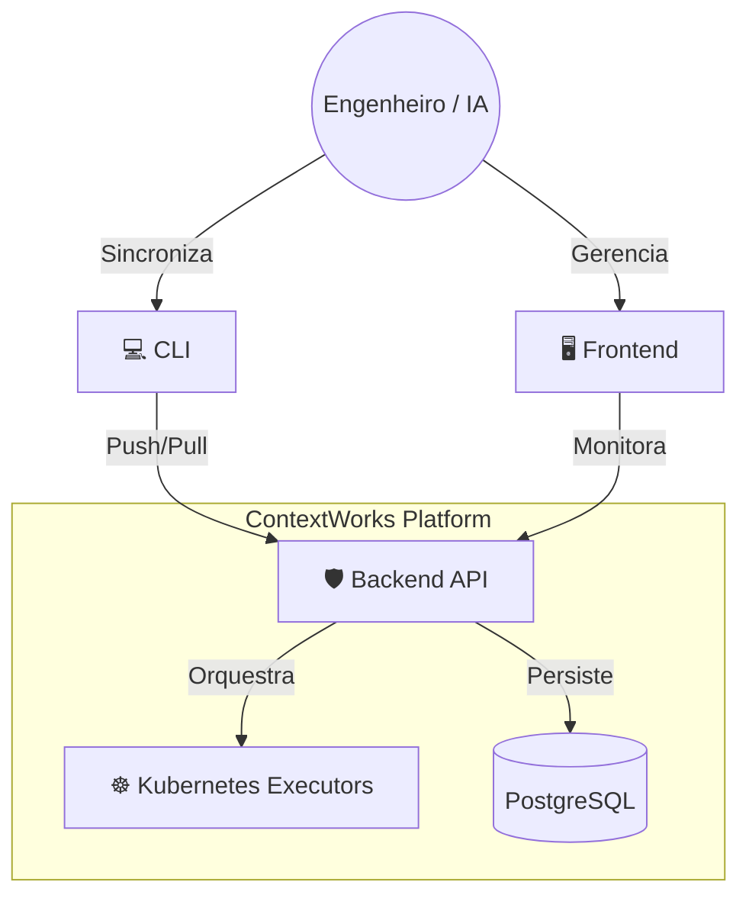

# 🌐 ContextWorks Platform

[](https://contextworks.com)
[](https://kubernetes.io)
[](https://modelcontextprotocol.io)
[](LICENSE)

> **The Enterprise Grade Tool Orchestration Platform.**

Transforme scripts soltos, ferramentas de segurança e automações operacionais em uma plataforma **governada**, **auditada** e **escalável** sobre Kubernetes. O ContextWorks é a ponte definitiva entre seus engenheiros, suas ferramentas e seus Agentes de IA.

---

## 🏛️ Arquitetura de Alto Nível

O ContextWorks unifica três pilares fundamentais em uma experiência coesa:



## 🚀 Componentes da Plataforma

Cada módulo do ContextWorks foi desenhado para excelência em sua função:

### [💻 CLI (Command Line Interface)](cli/README.md)
A interface preferida dos desenvolvedores.
- Sincronização bidirecional de scripts Python.
- Gestão de múltiplos contextos (Dev/Prod).
- TUI (Text User Interface) rica e interativa.

### [🛡️ Backend (Core Engine)](backend/README.md)
O cérebro da operação.
- Orquestração de Jobs Kubernetes efêmeros.
- Autenticação e RBAC Enterprise.
- Implementação nativa do protocolo MCP para LLMs.

### [🖥️ Frontend (Dashboard)](frontend/README.md)
Visibilidade e controle total.
- Editor de código integrado (Monaco).
- Streaming de logs em tempo real.
- Gestão visual de workspaces e ferramentas.

---

## 💡 Por que ContextWorks?

### 🔒 Segurança em Primeiro Lugar
Esqueça scripts rodando em máquinas de desenvolvedores ou servidores SSH compartilhados.
- **Isolamento Total**: Cada execução roda em um container isolado e efêmero.
- **Auditoria**: Quem executou, quando e qual foi o output? Tudo fica registrado.
- **Segredos**: Integração com Kubernetes Secrets.

### 🤖 Pronto para a Era da IA
O ContextWorks implementa nativamente o **Model Context Protocol (MCP)**.
Isso significa que você pode conectar Claude, GPT-4 ou agentes customizados à sua plataforma e dar a eles a capacidade segura de usar suas ferramentas internas.

---

## 📚 Documentação do Produto

Para uma visão aprofundada sobre como o ContextWorks transforma operações de TI:

- [📄 Whitepaper do Produto](docs/product_whitepaper.md): Visão estratégica e casos de uso.
- [🔐 Segurança Enterprise](docs/enterprise_security.md): Arquitetura de segurança, RBAC e compliance.

---

## ⚡ Quick Start (All-in-One)

Para subir a stack completa localmente (requer Docker e Make):

```bash
# Clone o repositório
git clone https://github.com/neto007/ContextWorks.git
cd ContextWorks

# Suba a infraestrutura via Docker Compose (Dev Mode)
make dev-up
```

Acesse:
- **Frontend**: http://localhost:5173
- **Backend API**: http://localhost:8000/docs
- **MCP Server**: http://localhost:8000/mcp

---

© 2026 ContextWorks Team.
