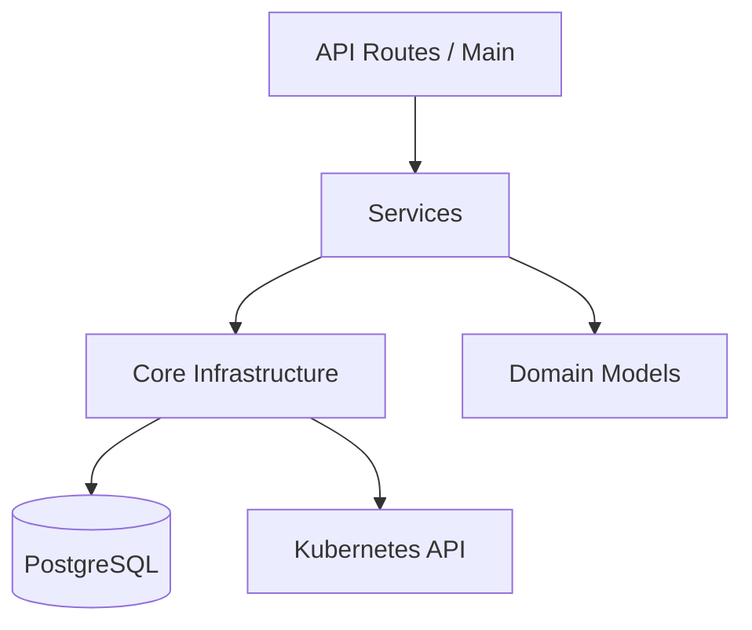

# 🏗️ Arquitetura do Backend

O backend foi projetado seguindo princípios de **Clean Architecture** e **Service Layer Pattern**, garantindo desacoplamento entre a infraestrutura (Core) e regras de negócio (Services).

## Estrutura de Camadas



### 1. Core (`core/`)
Responsável apenas por conectar com infraestrutura externa. **Não deve conter lógica de negócio.**
- `database.py`: Gerencia pool de conexões SQLAlchemy e sessão assíncrona.
- `kubernetes.py`: Carrega a configuração do cluster (in-cluster ou kubeconfig) e expõe o cliente API.
- `security.py`: Utilitários criptográficos (brypt) e geração/validação de tokens JWT.

### 2. Services (`services/`)
O coração da aplicação. Contém toda a lógica de negócio.
- **ToolService**: Gerencia o ciclo de vida das ferramentas (scan, create, update, delete). É agnóstico de execução.
- **ExecutionService**: Especialista em transformar uma requisição de execução em um Job Kubernetes. Gerencia o streaming de logs.
- **MCPManager**: Lida com servidores MCP remotos e suas chaves de API.

### 3. API (`main.py` & `api/`)
Camada "burra" que apenas recebe HTTP Requests, valida schemas (Pydantic) e chama o Service apropriado.

## Padrões Adotados

### Injeção de Dependência
Usamos o sistema de DI do FastAPI (`Depends`) para injetar sessões de banco de dados e o usuário atual nas rotas.

```python
@app.post("/tools")
async def create_tool(tool: ToolCreate, db: AsyncSession = Depends(get_db)):
    return await tool_service.create(db, tool)
```

### Assincronismo
Toda a aplicação é `async/await`. Operações de I/O (Banco, K8s API, HTTP Calls) nunca devem bloquear o Event Loop principal.

### Tratamento de Erros
Exceções de negócio devem ser tratadas nos Services e relançadas como `HTTPException` apenas na camada de API ou via Middleware global.
