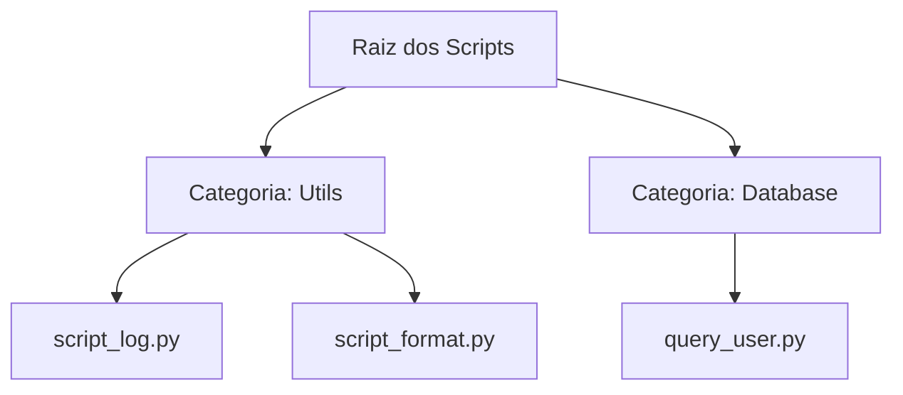

# 💡 Conceitos Core

Entender os conceitos fundamentais do **ContextWorks CLI** é essencial para tirar o máximo proveito da ferramenta.

## 1. O Modelo de Sincronização

Diferente de sistemas de arquivos tradicionais, o CLI trata o seu diretório local como a **Fonte da Verdade** (quando usando `sync`).

- **Descoberta Automática**: O CLI percorre suas pastas e identifica subpastas como `Categorias/Workspaces` e arquivos `.py` como `Tools/Scripts`.
- **Match de Metadata**: Ele compara o hash do conteúdo local com o que está no servidor para decidir se precisa realizar um upload ou update.
- **Pruning**: O conceito de "prune" permite manter o servidor limpo, removendo automaticamente ferramentas que foram deletadas localmente.

## 2. Contextos e Perfis

O CLI permite que você trabalhe com múltiplos servidores ou ambientes simultaneamente através de **Contextos**.

- **Configuração Local**: As configurações são guardadas em `~/.contextworks/config.json`.
- **Multi-tenant**: Você pode ter um contexto chamado `local` apontando para `localhost:8001` e outro chamado `prod` apontando para a nuvem.
- **Segurança**: Tokens de acesso são armazenados de forma segura dentro do arquivo de configuração, vinculados a cada contexto.

## 3. Categorias e Organização

A organização no servidor reflete diretamente a sua estrutura de pastas:

- Cada **pasta** de primeiro nível torna-se um **Workspace/Categoria** no ContextWorks.
- Cada **arquivo .py** torna-se uma **Ferramenta (Tool)** dentro daquele Workspace.

## 4. Modo TUI vs JSON

O CLI foi desenhado para ser amigável tanto para humanos quanto para máquinas:

- **TUI (Text User Interface)**: Quando executado normalmente, oferece uma interface visual rica, com barras de progresso e notificações coloridas.
- **JSON Mode**: Ao usar `--json`, o CLI silencia a interface visual e retorna apenas dados estruturados em STDOUT, facilitando a integração com ferramentas como `jq`, `awk` ou plataformas de CI/CD como GitHub Actions.
